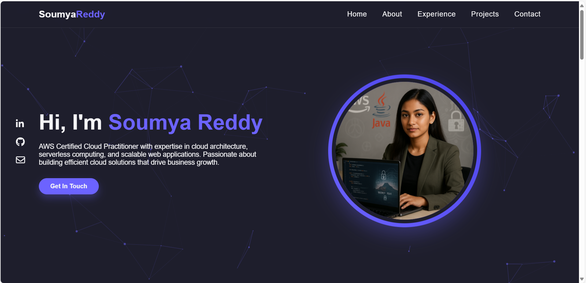

# 🌟 Soumya Reddy - Cloud Engineer Portfolio

  
  
  
  

 <!-- Replace with actual screenshot -->

A stunning animated portfolio website showcasing AWS cloud skills with particle.js effects and responsive design.

## 🚀 Features

- ✨ Interactive particle.js background
- 📱 Fully responsive (mobile, tablet, desktop)
- 🎯 Smooth scroll navigation
- 💻 Project showcase with GitHub links
- 📧 Functional contact form
- ⚡ Performance optimized